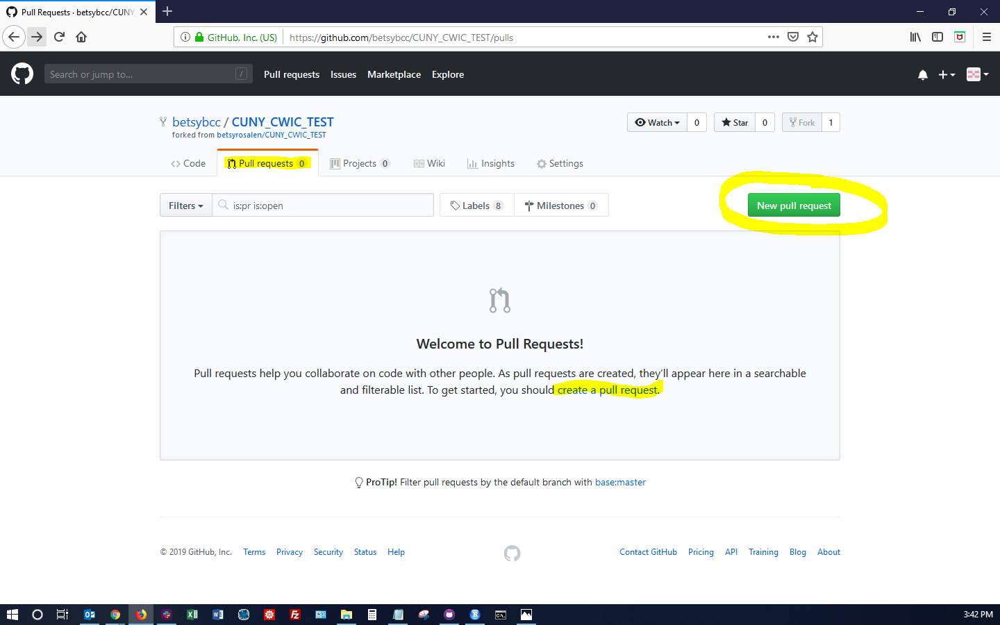
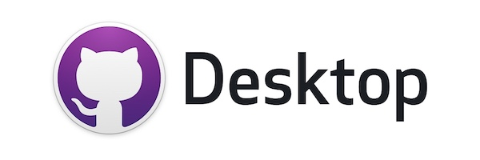

```{r global_options, echo=FALSE}
knitr::opts_chunk$set(echo=FALSE, warning=FALSE, message=FALSE)
```

Agenda
========================================================

## Slide Presentation

1. What are Git and GitHub
2. Basics of working in GitHub on the web and with GitHub Desktop
3. 2 short videos of basic workflows in GitHub and GitHub Desktop

## Demo 

1. Basic navigation and workflows on the GitHub website and in GitHub Desktop
2. How to use GitHub Desktop to manage multiple versions of a project - Student Data Book Example
    
## Possible Interactive Exercise

1. Create a GitHub account and go through a basic work flow 
2. Install Git and GitHub Desktop if you don't already have them installed
3. Use GitHub Desktop to push and pull changes to and from your repo


The 'Git' in GitHub
========================================================

**Git** is an open-source version control system that was created by Linus Torvalds - the same person who created Linux.

<table>
<tr>
<td width="400"></td>
<td></td>
</tr>
</table>

Source:
<https://www.howtogeek.com/180167/htg-explains-what-is-github-and-what-do-geeks-use-it-for/>

Link to this presentation: 
<http://rpubs.com/betsyrosalen/CUNY_OAREDA_GitHub>


The 'Git' in GitHub
========================================================

**Version control** is a way of making it easier to:

- keep track of changes to a project
- revert to earlier versions of a project
- manage multiple versions of a project
- collaborate with others on a project
- download project files even if you are not involved in development


The 'Git' in GitHub
========================================================

Git is run in the command line (or Terminal on Mac)

<table>
<tr>
<th>Command Prompt (Windows)</th>
<th>Terminal (Mac OS)</th>
</tr>
<tr>
<td></td>
<td></td>
</tr>
</table>

Git is the **preferred version control system of most developers**, since it has multiple advantages over the other systems but it is NOT just for developers!


The 'Hub' in GitHub 
========================================================

"**the center around which all things involving Git revolve is the hub - GitHub.com** - where developers store their projects and network with like minded people."

<table>
<tr>
<td></td>
</tr>
</table>

Basically **GitHub** is a code hosting / GUI / Website / Community / Social Networking Site built around using Git.

You can do almost everything from the GitHub Website and the GitHub Desktop application without ever having to learn the Git command prompts.


The 'Hub' in GitHub
========================================================

## Social networking

Each user on GitHub has their own profile that acts like a resume of sorts, showing your past work and contributions to other projects via pull requests.

Project ideas and changes can be discussed publicly, so a mass of contributors can collaborate to advance a project forward. 

<table>
<tr>
<td></td>
</tr>
</table>


Getting Started
========================================================

The first two (or three) things you need to do if you want to use Git and GitHub are:

  - Install Git <https://git-scm.com/downloads>
  - Create a free GitHub account <https://github.com/>
  - Optionally also install GitHub Desktop <https://desktop.github.com/> 
    - **OPTIONAL BUT HIGHLY RECOMMENDED!**

<br>

**We will use the GitHub website** today at first and if time allows I will show you how to do the same workflows in GitHub Desktop.  If there isn't enough time, we will do that in the next session.


Creating a Repository
========================================================

A **repository** (usually abbreviated to "**repo**") is a location where all the files for a particular project are stored. Each project has its own repo, and you can access it with a unique URL.

<table>
<tr>
<td></td>
</tr>
</table>


Creating a Repository
========================================================

The 'Repository name' you choose when you create a repo will be part of the unique URL for your repo.  So no spaces or weird characters allowed!

I recommend initializing your repo with a README file by checking the box at the bottom before you click "Create repository".

<table>
<tr>
<td></td>
</tr>
</table>


Making Changes to Your New Repo!
========================================================

Notice your username and the name of your repo after github.com in the URL...

To make changes click on the pencil icon to edit the file.  If you have multiple files, click on the name of the file first then on the pencil...

<table>
<tr>
<td></td>
</tr>
</table>


Committing Changes
========================================================

Type your changes directly into the file on GitHub...

<table>
<tr>
<td></td>
</tr>
</table>

Then scroll down and add a summary of your changes then click "Commit changes". 

<table>
<tr>
<td></td>
</tr>
</table>


Forking a Repo
========================================================

"**Forking**" is when you create a new project (repo) in your account that is a copy of another project (repo) that already exists in another users account so that you can work on it without changing the original repo. 

<table>
<tr>
<td></td>
</tr>
</table>


Forking a Repo
========================================================

<table>
<tr>
<td></td>
</tr>
</table>


Pull Requests
========================================================

Once you've made changes and committed them to the forked repo if you want to contribute them to the official repository you create a "**pull request**" asking the authors of the original repository to pull your changes into the official project.

## First method...  Code Tab

<table>
<tr>
<td></td>
</tr>
</table>


Pull Requests
========================================================

## Second method...  Pull Requests Tab

<table>
<tr>
<td></td>
</tr>
</table>


Pull Requests
========================================================

## Comparing Changes

You will have an opportunity to review your changes before submitting the request...

<table>
<tr>
<td></td>
</tr>
</table>


Pull Requests
========================================================

## Submitting the Request

**Put a detailed description** of the changes you are asking the original repo owners to pull into their project.  

Would you pull in some stranger's changes without any explanation!?

<table>
<tr>
<td></td>
</tr>
</table>


Pull Requests
========================================================

## Approving the Pull Request

The authors of the original repo that you forked will receive a notification in GitHub letting them know that someone (you) submitted a pull request...

<table>
<tr>
<td></td>
</tr>
</table>


Pull Requests
========================================================

## Approving the Pull Request

They can then review your changes and your detailed commit description and merge your pull request into the main branch of the original repository... 

###### (NOTE the old 'Master' terminology in the screenshots was replaced with 'Main' for racial sensitivity reasons.)

<table>
<tr>
<td></td>
</tr>
</table>


Basic Workflow
========================================================

Here's a really quick 2 min video that shows the basic GitHub Workflow:

  - fork a repo
  - make a change in the forked repo
  - commit the change to your forked repository
  - send a pull request with a detailed commit description
  - repo authors (hopefully) accept the pull request

<https://www.youtube.com/watch?v=yr6IzOGoMsQ>


Create a Branch
========================================================

### **Branching** is the way to work on different versions of a repository at one time.

By default your repository has one branch named main which is considered to be the definitive branch. Use branches to experiment and make edits before committing them to main.  **It's like forking your own repo**.

When you create a branch off the main branch, you're making a copy, or snapshot, of main as it was at that point in time. 

I will explain branches more when we go over the Student Data Book version management example.


Avoiding the Dreaded 'Conflict'
========================================================

GitHub will throw an error called a '**conflict**' if two people make changes to the same section of a document at roughly the same time and both try to commit and push those changes to the repo.

An easy way to avoid this is to work within separate sections separated by headers.  For example set up headers in the document at the start of the project so different people can work on different sections like this...

```
# My Awesome Code

## Section One

One person works here...

## Section Two

Another person works here...

## Section Three

A third person works here...
```

The sections can be called anything you want and don't even need to be commented out, they just need to be unchanged so that Git can recognize them in each new commit.  


GitHub Desktop
========================================================

### Basics of working with GitHub Desktop

This is a video I made for my classmates to show them how to connect directly to my repo through GitHub Desktop so that they could push changes without sending a pull request asking for approval.  In order to do that you have to make them a **collaborator** on your repo in the settings first, but the same steps can be used to clone your own repo to work with it on your laptop.  

<https://youtu.be/DagKA0ytHZY>

The **big advantage** to working on your laptop or desktop computer and pushing changes through Git or GitHub Desktop is that **you can work in your favorite text editor** so you have syntax highlighting etc. and don't have to make all your changes directly on the GitHub website.

<table>
<tr>
<td></td>
</tr>
</table>


Learn More
========================================================

There are lots of **tutorials and how-to videos** on the internet if you just google, but here are a few especially good resources...

### Interactive Git Tutorials

- <https://www.codecademy.com/learn/learn-git>
- <https://learngitbranching.js.org/>

### Video class on Git

- Git Real <https://www.pluralsight.com/courses/code-school-git-real>

### Git Cheat Sheet

- <https://education.github.com/git-cheat-sheet-education.pdf>

### Really detailed information about using Git in the command prompt...

- Pro Git Book <https://git-scm.com/book/en/v2>

### GitHub YouTube Channel

- <https://www.youtube.com/user/GitHubGuides/videos>


Interactive Exercise!
========================================================

Use this presentation: <http://rpubs.com/betsyrosalen/CUNY_OAREDA_GitHub> to guide you through the following exercise...

1. **Pair up!** 
2. **Create a GitHub Account** - You will need to access your email to confirm your account!
3. **Login and create your first repo!** 
4. **Make a change to your repo and commit the changes.** 
5. **Ask your partner for the URL of their repo and fork it!** 
6. **Make changes and commit them to your forked repo.** 
7. **Send a pull request** 
8. **Accept your partner's pull request.** 
9. Optional - **Try branching your repo, committing changes to the branch, and then merging the branch into the main**
10. Bonus Points - **Install Git and GitHub Desktop, clone your repo, and push changes using GitHub Desktop!**

**I am here to help if you have questions!**